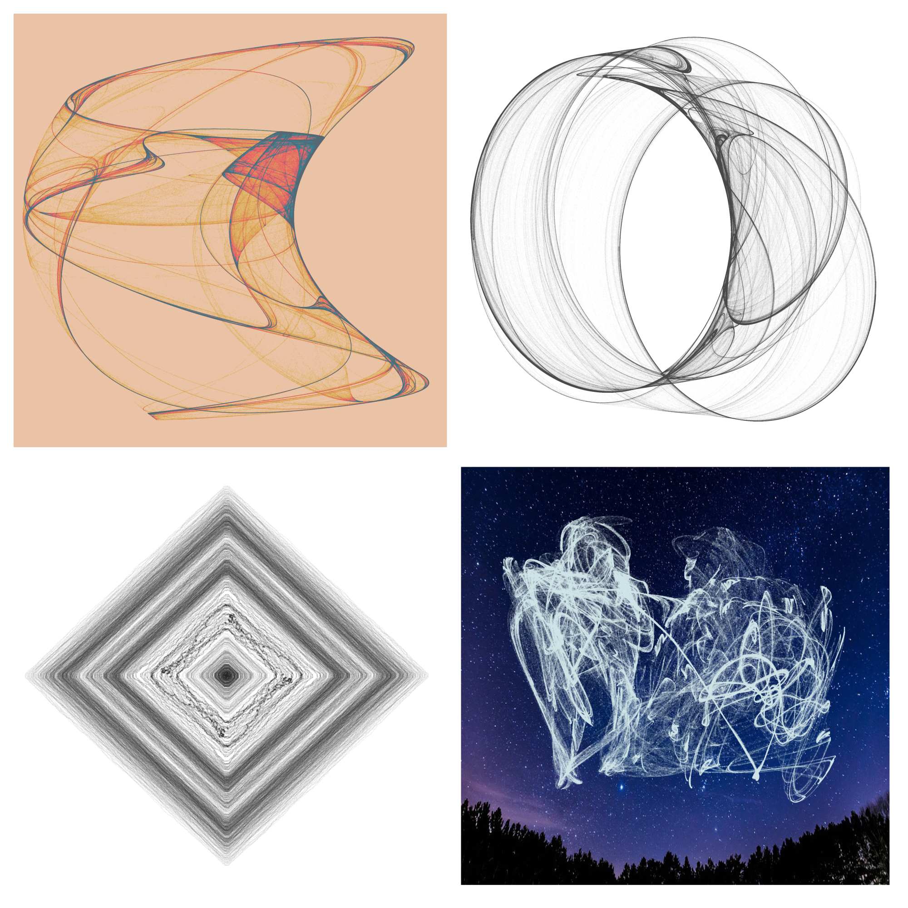
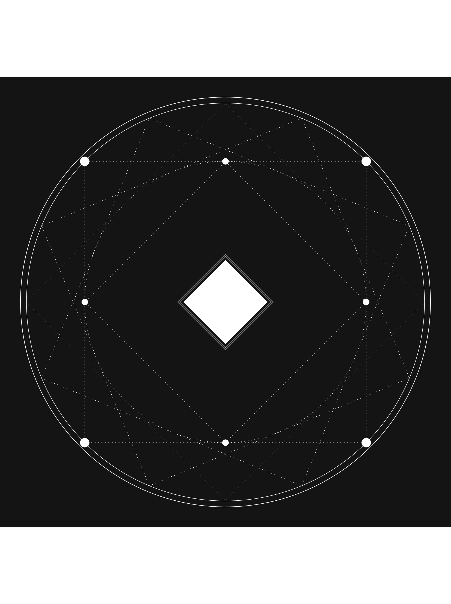
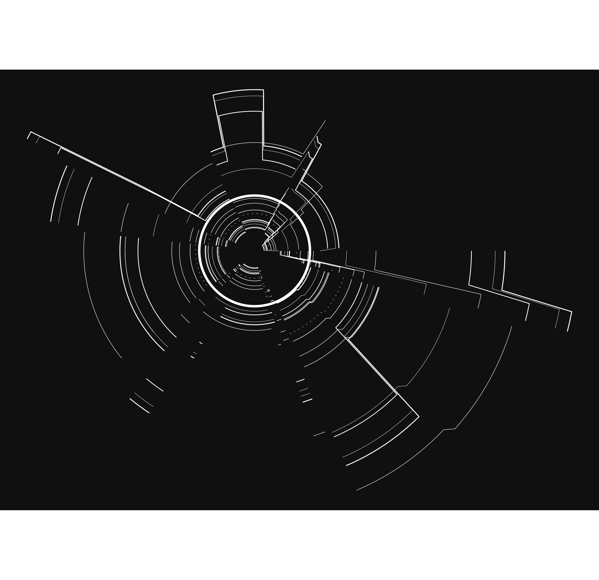
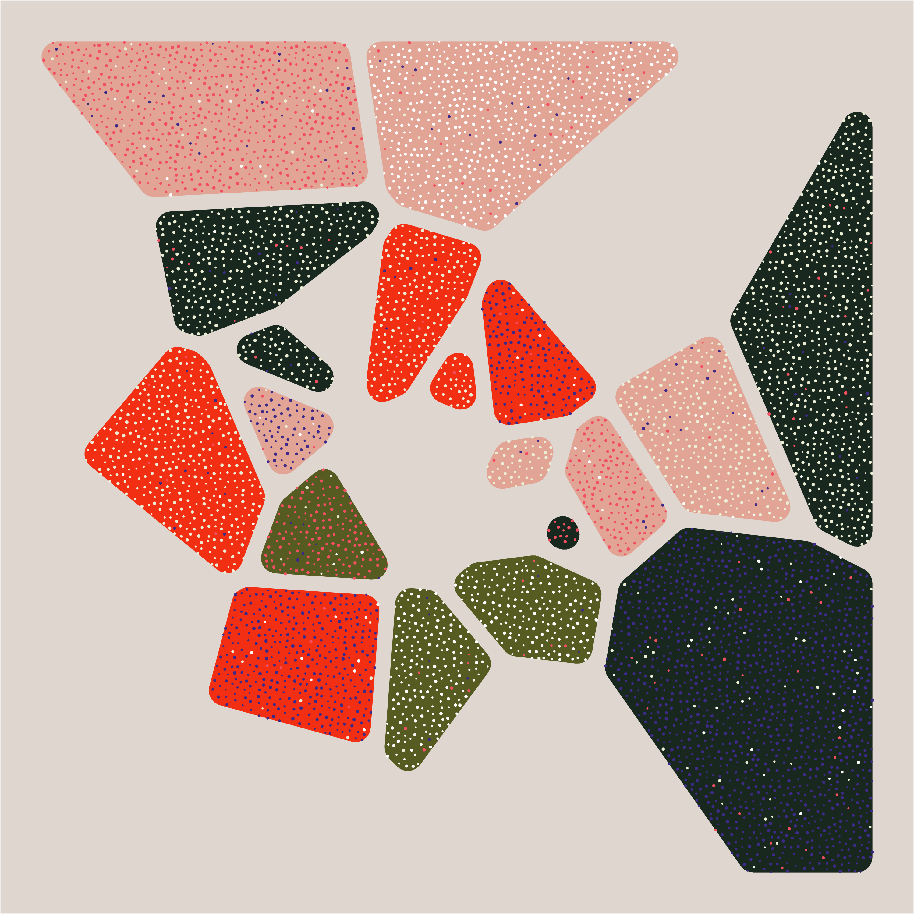
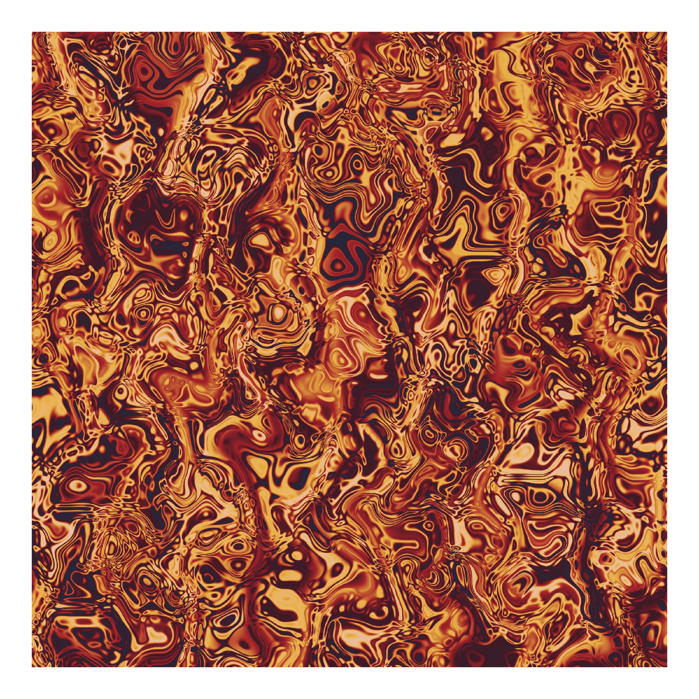
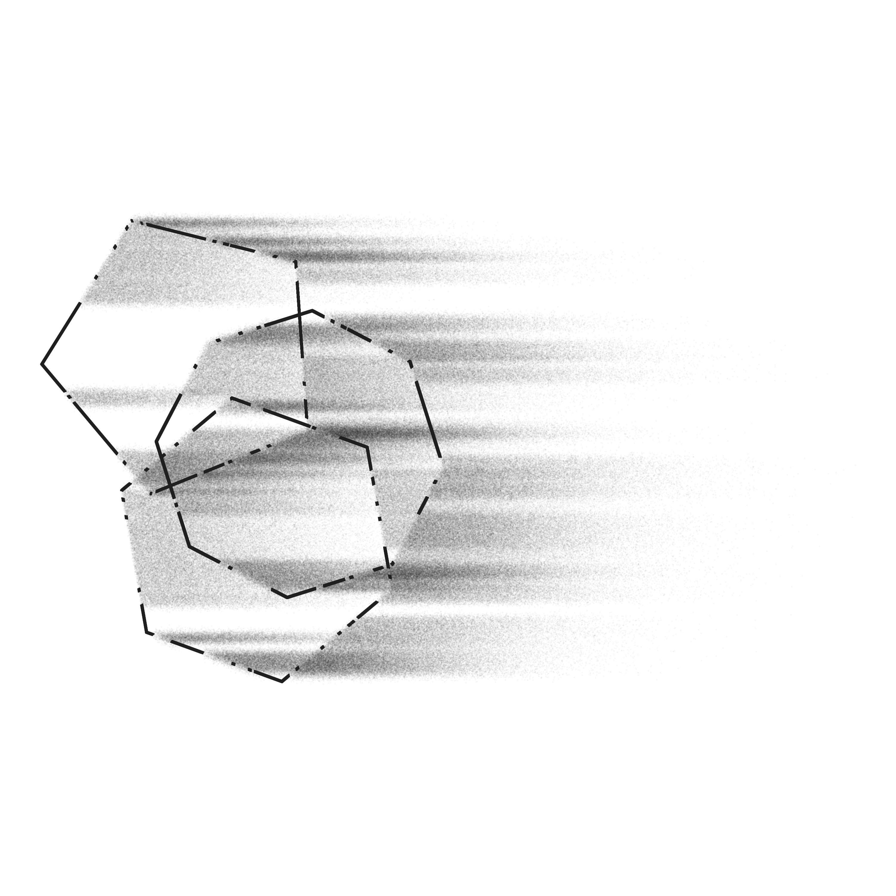
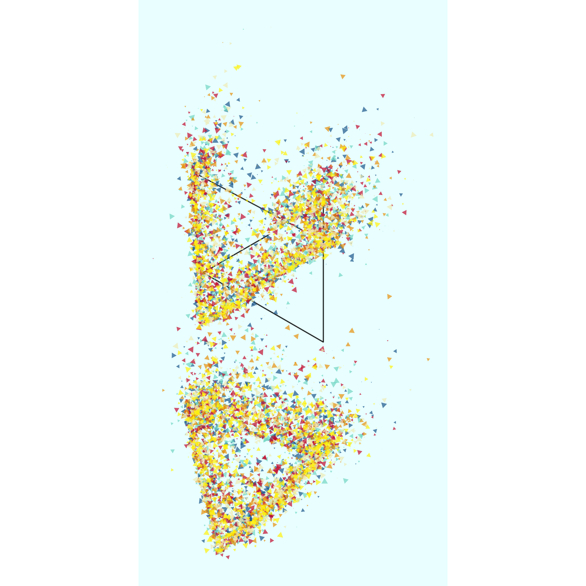
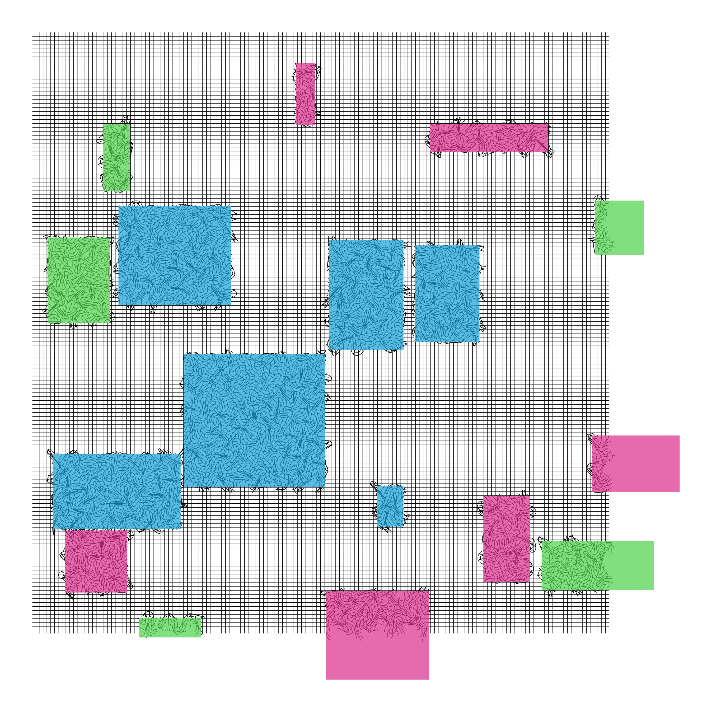

# 12 Months of aRt

This is the repository for my 12 Months of aRt project. Each month of 2019 I tackle a new generative/data art project. All of this work is done with R. Read more about it in my <a href="https://www.williamrchase.com/post/12-months-of-art/" target="_blank">project intro blog post</a>. There is a folder for each month that contains all of the code and art along with a readme to explain how to use the scripts. Each month also has an accompanying blog post which you can find below that explains the process and shows off many of the art pieces. 

## January: tessellated menagerie

Tessellated animals

Blog post: <a href="https://www.williamrchase.com/post/tessellated-menagerie-12-months-of-art-january/" target="_blank">https://www.williamrchase.com/post/tessellated-menagerie-12-months-of-art-january/</a>

## February: strange attractors

Strange attractors

Blog post: <a href="https://www.williamrchase.com/post/strange-attractors-12-months-of-art-february/" target="_blank">https://www.williamrchase.com/post/strange-attractors-12-months-of-art-february/</a>

## March: art of pi

Art of pi

Blog post: <a href="https://www.williamrchase.com/post/animating-pi-12-months-of-art-march/" target="_blank">https://www.williamrchase.com/post/animating-pi-12-months-of-art-march/</a>

## April: orbital glyphs, part 1

Orbital glyphs / summoning circles

Blog post: <a href="https://www.williamrchase.com/post/orbital-glyphs-part-1-12-months-of-art-april/" target="_blank">https://www.williamrchase.com/post/orbital-glyphs-part-1-12-months-of-art-april/</a>

## May: orbital glyphs, part 2

This month I made several improvements to my glyph algorithms, and turned the whole thing into a package! You can find the package at <a href="https://github.com/will-r-chase/glyph" target="_blank">https://github.com/will-r-chase/glyph</a>

Blog post: <a href="https://www.williamrchase.com/post/orbital-glyphs-part-2-12-months-of-art-may/" target="_blank">https://www.williamrchase.com/post/orbital-glyphs-part-2-12-months-of-art-may/</a>

## June: artistic coding for the useR

This month I wrote a blog post summarizing what I've learned in the first half of my 12 Months of aRt project. The post includes a list of packages to help make aRt, tutorials and blogs to help you get started with aRt, and a list of people to follow on Twitter for inspiration. 

Blog post: <a href="https://www.williamrchase.com/post/artistic-coding-for-the-user-12-months-of-art-june/" target="_blank">https://www.williamrchase.com/post/artistic-coding-for-the-user-12-months-of-art-june/</a>

## July: textures and geometric objects

Abstract sketches made up of geometric patterns and textures.

Blog post: <a href="https://www.williamrchase.com/post/textures-and-geometric-shapes-12-months-of-art-july/" target="_blank">https://www.williamrchase.com/post/textures-and-geometric-shapes-12-months-of-art-july/</a>

## August: noise algorithms

An exploration of the Ambient package for generating procedural noise.

Blog post: <a href="https://www.williamrchase.com/post/noise-12-months-of-art-august/" target="_blank">https://www.williamrchase.com/post/noise-12-months-of-art-august/</a>

## September: flow fields

Exploring flow fields with curl noise, particles, and polygons.

Blog post: <a href="https://www.williamrchase.com/post/flow-fields-12-months-of-art-september/" target="_blank">https://www.williamrchase.com/post/flow-fields-12-months-of-art-september/</a>

## October: disintegration

Rigid shapes disintegrating in the wind. 

Blog post: <a href="https://www.williamrchase.com/post/disintegration-12-months-of-art-october/" target="_blank">https://www.williamrchase.com/post/disintegration-12-months-of-art-october/</a>

## November: disintegration, part 2

Rigid shapes disintegrating, now with polygons, noise, and colors!

Blog post: <a href="https://www.williamrchase.com/post/disintegration-part-2-12-months-of-art-november/" target="_blank">https://www.williamrchase.com/post/disintegration-part-2-12-months-of-art-november/</a>

## December: grid

Grids that distort when they pass through polygons

Blog post: <a href="https://www.williamrchase.com/post/grid-12-months-of-art-december/" target="_blank">https://www.williamrchase.com/post/grid-12-months-of-art-december/</a>

